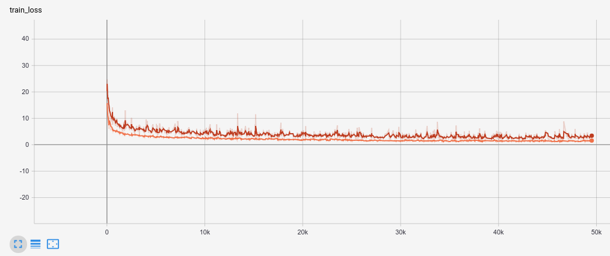

# HVNet: Hybrid Voxel Network for LiDAR Based 3D Object Detection

This is an unofficial implementation of paper HVNet. And the code is based on [PCDet](https://github.com/open-mmlab/OpenPCDet) and [PointCloudDynamicVoxel](https://github.com/AndyYuan96/PointCloudDynamicVoxel).

Please follow PCDet and PointCloudDynamicVoxel's install guide.

```
remote:
	project on server for training
local:
	project on local machine to debug and I add some visualization code.
```

The author only provide bev result for Pose Loss, so I compare my result with paper.
Cyclist and Car don't have too much different with paper, but Pedestrian is lower than paper for 4 point in AP

```
model: remote/pos_loss/checkpoint_epoch_66.pth
Pose loss result
Pedestrian AP_R40@0.50, 0.50, 0.50:
bbox AP:78.9463, 74.2541, 70.1590
bev  AP:70.3723, 64.2458, 59.4957
3d   AP:64.3090, 57.9833, 52.6859
aos  AP:58.83, 55.68, 52.18
Cyclist AP_R40@0.50, 0.50, 0.50:
bbox AP:92.2565, 77.7238, 74.9210
bev  AP:89.3720, 73.0727, 68.3603
3d   AP:84.5124, 67.7432, 63.2935
aos  AP:91.51, 76.41, 73.55
Car AP_R40@0.70, 0.70, 0.70:
bbox AP:97.4905, 91.9816, 89.3797
bev  AP:94.4907, 88.2296, 85.4464
3d   AP:87.3334, 75.7501, 72.7637
aos  AP:97.42, 91.61, 88.81
```


For corner loss, I didn't get a similar result with paper, but the training loss looks reasonable. Orange one is pos loss



Welcome to contribute if you have any improvement.